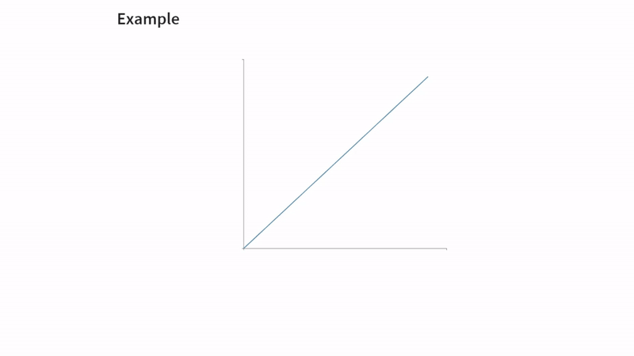

# Animate-graph Extension For Quarto

Create clear, step-by-step visualizations to enhance your teaching and explanations in [Reveal.js](https://revealjs.com/) without any coding knowledge. By defining HTML elements with specific attributes, such as divs and spans, users can specify data and customize visual elements. The package automatically converts these elements into SVG elements using [D3.js](https://d3js.org/), enabling smooth transitions and animations. It can plot curves, points, and filled areas along with annotations and animate their transitions (position or appearance) synchronized with Reveal.js fragments. All you need to know is [how to add divs and spans](https://quarto.org/docs/authoring/markdown-basics.html#sec-divs-and-spans) in your [Quarto](https://quarto.org/) document.


__Key Features:__

- Simplified integration with Reveal.js presentations.
- No coding required; users define visual elements using HTML attributes.
- Supports step-by-step animations and transitions.
- Plots curves, points, filled areas, and annotations.





## Installing 

_TODO_: Replace the `<github-organization>` with your GitHub organization.

```bash
quarto add <github-organization>/animate-graph-revealjs
```

This will install the extension under the `_extensions` subdirectory.

## Enabling


This package depends on [D3.js](https://d3js.org/); it must be loaded along with the plug in utilizing `include-in-header`. 
To use the extension, add the following to your document's front matter:

```yaml
format:
  revealjs: 
    include-in-header: 
      - text: '<script src="https://cdn.jsdelivr.net/npm/d3@7"></script>'
revealjs-plugins:
  - animate-graph
```

If you want to render math expressions, you also need to use Katex for the math method:

```yaml
format:
  revealjs:
    html-math-method: katex
```


## Basic Usage

- There are four main components of this plug in:
  - `graph`, `element`, `move`, and `setAttribute`.
- To generate an animated graph:
  - Create a div with class __animategraph__.
  - Create a span within `div.animategraph` with class __addElement__ to add an element.
  - Create a span within `div.animategraph` with class __move__ to change the position of an element.
  - Create a span within `div.animategraph` with class __setAttribute__ to the appearance of an element.


```{verbatim}
:::{.animategraph}

[]{.addElement required-attributes}
[]{.move required-attributes}
[]{.setAttribute required-attributes}

:::
```


- The plug in comes with a predefined data named `econ`.
  - It is the default data for the graph. 
    - See [`econ` Dataset](#econ-dataset) section below for the list of variables available.
  - To `define a` new data, please see [Defining Data](#defining-data) section below.
  

### A Basic Usage Using the Default Data

1. Define a div with class _animategraph_.
```{.markdown}
:::{.animategraph}

:::
```

2. Define an element within this div using the following template (all fields are required, except _id_):

- For `line`:
    
```{.markdown}
[]{ .addElement type='line' var-x='name of the variable x' var-y='name of the variable y' id="name of the element"}
```

- For `point`:
    
```{.markdown}
[]{ .addElement type='point' var-x='x coordinate' var-y='y coordinate' id="name of the element"}
```

- For `area`:

```{.markdown}
[]{ .addElement type='area' var-x='name of the variable x' var-y0='name of the first y variable' var-y1='name of the second y variable' id="name of the element"}
```

- For `text`:
```{.markdown}
[]{ .addElement type='text' var-x='x coordinate' var-y='y coordinate' text='text to be printed' id="name of the element"}
```

- For `ticks`:

```{.markdown}
[]{ .addElement type='tick' var-x='position of ticks on x axis' label-x='text to be printed on these positions' var-y='position of ticks on x axis' label-y='text to be printed on these positions' id="name of the element"}
```
  
- There are few alterations to these required fields, which explained in below.
- Id is not required to generate an element, but it is required to change position or appearance. 
  
3. Specify a movement within `div.animategraph` using the following template (all fields are required):
```{.markdown}
[]{ .move var-x='new x variable' var-y='new y variable' index='when the action will happen'  id="name of the element"}
```

4. Specify a change in appearance within `div.animategraph` using the following template:
```{.markdown}
[]{ .setAttribute attributeA="value of attribute A" style="css style" index='when the change will happen'  id='name of the element'}
```


## Minimal Example

```{.markdown}

:::{.animategraph}

[]{ .addElement type='line' var-x='quantity' var-y='supply'  }
[]{ .addElement type='line' var-x='quantity' var-y='demand' id='demand' index=0 } 
[]{ .addElement type='point' var-x='2.5' var-y='2.5' id='equilibrium' index=1   lines="true" }
[]{ .addElement type='tick' var-x='2.5' label-x="$q^\\star$" var-y='2.5' label-y="$p^\\star$"  index=2 }
[]{ .addElement type='area' var-x='quantity' var-y0='supply' var-y1='demand' index=3 id='surplus'  }
[]{ .addElement type='text' var-x='1' var-y='2.5' text="Total Surplus" index=3   }
[]{ .move var-x='quantity' var-y='demand_right' id='demand' index=4  }
[]{ .move var-x='3' var-y='3' id='equilibrium' index=5  }
[]{ .addElement type='tick' var-x='3' label-x="$q^{\\star}_{new}$" var-y='3' label-y="$p^\\star_{new}$"  index=6 }
[]{ .move id='surplus' var-x='quantity' var-y0='supply' var-y1='demand_right' index=7  }

:::


```

